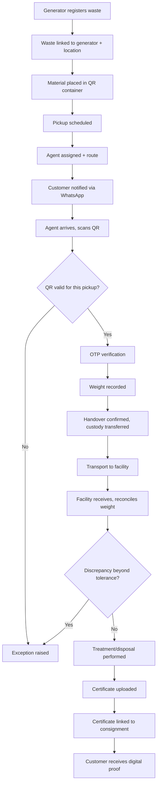
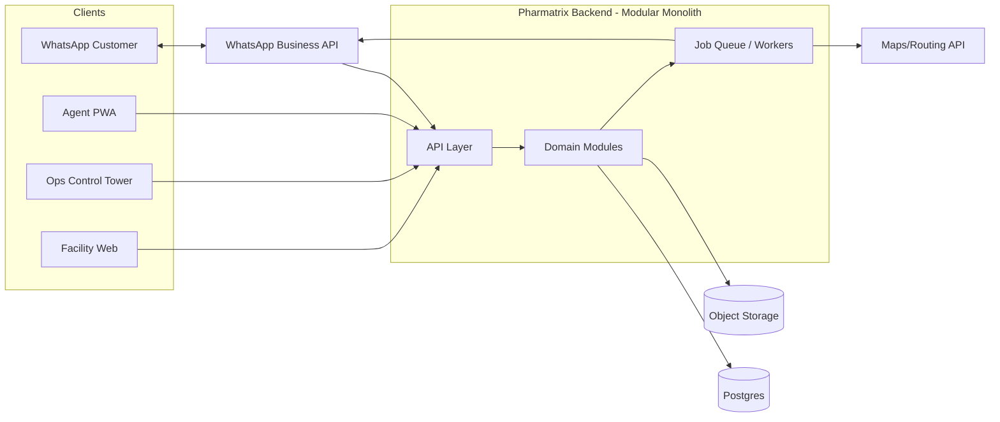
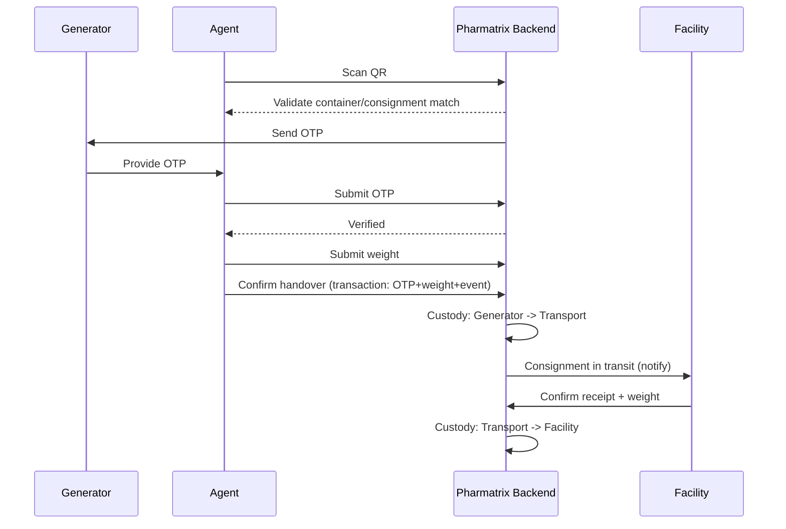
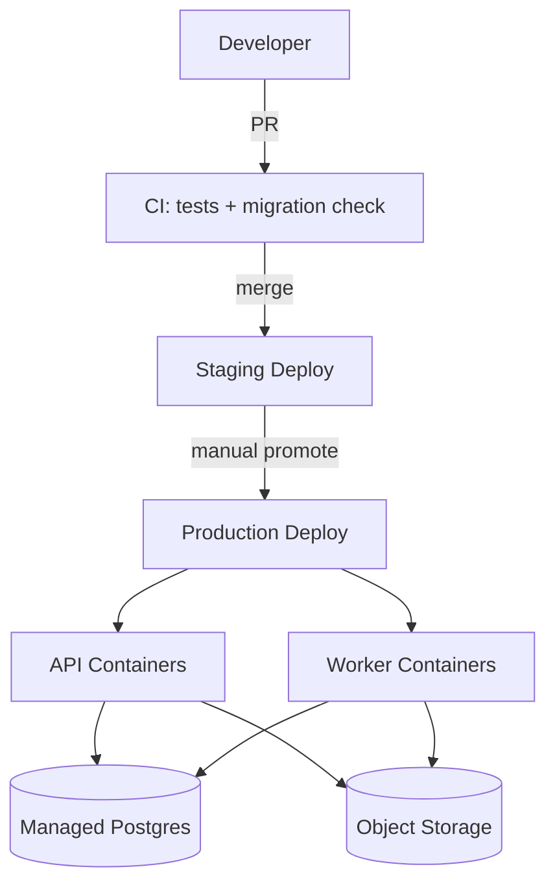

# Pharmatrix System Design

*Technical blueprint — v1. Assumptions are marked explicitly; treat them as defaults to confirm, not final decisions.*

---

## 1. Executive Summary

Pharmatrix is a **coordination and evidence platform** for pharmaceutical waste compliance. It does not own trucks or treatment facilities — it orchestrates licensed transporters and authorized treatment/recycling facilities on behalf of pharmaceutical distributors, wholesalers, and stockists, and produces auditable proof of compliant disposal or recovery.

The system of record is a relational database holding an **immutable event history** of every custody transfer, weight measurement, and verification step in a consignment's life. WhatsApp is the primary customer channel but never the source of truth. The MVP is a **modular monolith**, not microservices — the operational volume (regional, agent-mediated logistics) does not yet justify distributed-systems overhead, and a monolith is far cheaper for a small team to build, debug, and evolve.

Core recommended stack (reasoning in §35): Postgres, a single backend service (Node/NestJS or Python/FastAPI — team-dependent), S3-compatible object storage, a database-backed job queue (no Kafka), a mobile-first PWA or lightweight native app for agents, a web control tower for ops, and the WhatsApp Business Cloud API for customer/facility-light communication.

---

## 2. Product Understanding

**Explicit requirements** (from the brief and existing Pharmatrix materials):
- Coordinate registration → containerization → pickup → transport → treatment → certificate for pharmaceutical waste.
- Two disposal pathways already defined in the business model: **Return-to-Supplier** and **Authorized Disposal**, aligned to CDSCO's May 2025 expired-drug disposal guidance.
- Asset-light: Pharmatrix does not own vehicles or treatment facilities.
- Primary initial customer segment: **distributors, wholesalers, stockists** — not retail pharmacies first.
- Four interfaces: customer (WhatsApp-first), pickup agent (mobile), ops control tower (web), treatment facility (simple web).
- Chain of custody, weight reconciliation, and digital certificates are the core value, not just "an app to request pickup."

**Inferred requirements:**
- Because there are two disposal pathways with different endpoints (supplier vs. authorized facility), the **Consignment** and **Custody** models must be pathway-aware from day one, not bolted on later.
- Revenue model (recovery success fee, compliance subscription, disposal coordination fee, data insights) implies the platform must record enough structured data — material category, quantity, pathway, customer tier — to compute these four charge types later, even if billing isn't built at MVP.
- "Five structural compliance guardrails around licensed network boundaries, data siloing, and human authorization" implies: transporters/facilities must be modeled as *licensed entities with verifiable license references*, and certain transitions (e.g., certificate acceptance, exception resolution) require a human actor, not just a system event.

**Open questions** (answered as assumptions below, flagged where they'd change the architecture materially):
1. Geographic scope at launch (Bengaluru only, per financial model) — assumed yes.
2. Whether Return-to-Supplier consignments still require Pharmatrix-coordinated transport, or the supplier's own logistics — assumed Pharmatrix-coordinated for MVP (simpler, one workflow engine).
3. Whether facilities are Pharmatrix-recruited partners (closed set) or an open marketplace — assumed closed, curated set at MVP (this affects the facility interface's build priority: low, since a handful of facilities can be onboarded manually first).

---

## 3. Business Model

- **Recovery success fee**: charged when material is successfully returned to supplier / recovered rather than disposed (Return-to-Supplier pathway).
- **Compliance subscription**: recurring fee for ongoing compliance coordination and record-keeping, independent of volume.
- **Disposal coordination fee**: per-consignment or per-weight fee for Authorized Disposal pathway coordination.
- **Manufacturer data insights**: future revenue line — aggregated, anonymized data to manufacturers on expiry/return patterns. Treated as a downstream analytics product, not a core transactional dependency (§25, §29).

ASSUMPTION: Pricing is **snapshot-based** — each consignment stores the pricing rule version applied at creation, so historical invoices are unaffected by later pricing changes. REASON: explicitly required by the brief (§24) and standard for any billing-adjacent system. IMPACT IF WRONG: retroactive invoice drift, audit disputes.

---

## 4. Actors and Roles

| Role | Scope |
|---|---|
| Super Admin | Full platform access, org/user management, config |
| Operations Manager | Full operational visibility, scheduling, exception approval, facility/transporter management |
| Operations Staff | Day-to-day scheduling, monitoring, cannot manage users/config |
| Pickup Agent | Own assigned pickups only; scan, OTP, weight, handover |
| Transport Manager | Manages agents/vehicles/routes for a transporter org |
| Facility Admin | Full access within their facility: receive, reconcile, treat, certify |
| Facility Staff | Receipt and weight recording only, no certificate upload |
| Customer/Generator User | Own organization's consignments only: register, view status, approve OTP |

Least privilege: a Facility Staff user cannot see another facility's consignments; a Pickup Agent cannot see pickups not assigned to them; a Customer user cannot see other customers' data (tenant isolation, §15).

---

## 5. User Interfaces

As specified in the brief — WhatsApp (customer), mobile app (agent), web control tower (ops), simple web (facility). Design decisions per interface:

- **WhatsApp**: templated messages only for outbound (registration confirmation, pickup schedule, OTP, status updates, certificate delivery). Inbound is limited to structured replies (button/list replies) wherever possible to avoid needing NLP; free-text is logged but routed to a human ops queue rather than parsed automatically at MVP.
- **Agent app**: mobile-first, minimal-step design. ASSUMPTION: a **PWA** is sufficient for MVP rather than a native app, since agents work in defined urban zones with generally adequate connectivity and a PWA avoids app-store review cycles. REASON: speed to market. IMPACT IF WRONG: if connectivity is poor in expansion zones (Kolar-Tumakuru, Mysuru), a native app with a proper local database (e.g., SQLite via Capacitor) becomes necessary sooner — see §21.
- **Ops control tower**: a real operations console (live consignment board, exception queue, map view), not a generic admin CRUD panel.
- **Facility interface**: intentionally minimal — receipt confirmation, weight entry, treatment record, certificate upload.

---

## 6. Core Business Workflows

Two pathway variants branch at step B/D: **Return-to-Supplier** routes the consignment to a supplier receiving point instead of a treatment facility, and the terminal "certificate" becomes a **Return Acknowledgment** rather than a treatment certificate. Both are modeled as `Certificate` subtypes so the rest of the lifecycle is shared (§10, §12).

---

## 7. Domain Model

Central aggregate: **Consignment**. Reasoning: a Consignment is the unit that moves through custody, gets weighed, gets reconciled, and gets a certificate — everything else (containers, custody events, weight records) is either a child of it or references it. Pickup is a *scheduling* concept that produces/attaches to a Consignment; Consignment is the *lifecycle* concept. Keeping Consignment central (not Pickup) matters because a consignment's life continues well after the pickup event is done (transport, facility, treatment, certificate).

Key entities:

- **Organization** — a tenant: generator company, transporter company, facility, or Pharmatrix itself. (`type` enum)
- **User** — belongs to one Organization, has one or more Roles.
- **Generator** — a specific registered site/branch of a customer Organization (a distributor may have multiple warehouses).
- **Location** — address + geo-coordinates, reusable across Generator/Facility.
- **WasteCategory** — reference data (e.g., expired finished drugs, damaged stock, controlled substances subcategory) — needed because CDSCO handling rules differ by category.
- **Container** — physical unit with a QR identity; belongs to a Generator until collected, then to a Consignment.
- **QRIdentity** — separate from Container as a value object: a QR code is *issued to* a container, can be *replaced*, and the system must distinguish "this physical container" from "this QR code" for replacement/loss handling.
- **Consignment** — aggregate root: generator, pathway (ReturnToSupplier / AuthorizedDisposal), containers, expected/collected/received/final quantities, current custodian, facility or supplier destination, state.
- **Pickup** — a scheduled visit: date/time window, assigned agent, linked consignment(s) (a pickup can theoretically cover multiple consignments at one location — modeled as many-to-many via a join, but 1:1 is the common case).
- **Route** — ordered set of Pickups for an agent on a day.
- **Transporter** / **Vehicle** — the org and physical asset performing transport.
- **Facility** — licensed treatment/recycling site, or supplier receiving point (subtype via `facility_type`).
- **CustodyEvent** — immutable append-only record: actor, timestamp, location, consignment, event type (scanned / OTP-verified / weighed / handed-over / received / treated / certified), evidence reference.
- **WeightRecord** — one row per measurement stage (expected, collected, transport-handover, facility-received, final), never overwritten — corrections are new rows referencing the corrected one.
- **OTPVerification** — code, channel, expiry, consumed-at, associated CustodyEvent.
- **TreatmentRecord** — facility's disposal/treatment details, linked to Consignment.
- **Certificate** — document + metadata (issuing facility, type: TreatmentCertificate / ReturnAcknowledgment, immutable once issued — replacement creates a new version, §17).
- **Document** — generic file metadata (photos, supporting docs), pointer into object storage.
- **Exception** — raised against any lifecycle stage: type, raised-by, status, resolution, linked entity.
- **Notification** — outbound message log: channel, template, status, retries.
- **AuditLog** — generic "who did what to what, when, from what previous state" — separate from CustodyEvent, which is domain-specific; AuditLog covers *all* mutations including admin/config changes.
- **Billing/Charge**, **ServicePlan/PricingRule** — modeled as domain entities now (so Consignments can reference a pricing snapshot) but billing *execution* (invoicing) is out of MVP scope.

Value objects (not separate tables): Money (amount+currency), GeoPoint, TimeWindow.

Attributes, not entities: consignment `status` is derived/cached from the latest relevant CustodyEvent + state machine, not hand-set (§12).

---

## 8. State Machines

### 8.1 Consignment
`REGISTERED → CONTAINERIZED → PICKUP_SCHEDULED → COLLECTED → IN_TRANSIT → AT_FACILITY → RECONCILED → TREATED → CERTIFIED → CLOSED`
Side branch at any stage: `EXCEPTION` (does not replace the stage — an exception is a flag/child record; the consignment can re-enter its prior stage once resolved, or move to `CANCELLED`).
- Trigger `REGISTERED→CONTAINERIZED`: ops or generator confirms container assignment. Precondition: at least one Container with valid QR linked.
- Trigger `COLLECTED→IN_TRANSIT`: handover CustodyEvent recorded (OTP + weight + agent confirmation all present). Precondition: all three sub-steps complete — this is enforced as a DB transaction, not a UI convention.
- Trigger `AT_FACILITY→RECONCILED`: facility records received weight; if within tolerance, auto-transition; if not, `EXCEPTION`.
- Trigger `TREATED→CERTIFIED`: certificate document uploaded and linked. `CERTIFIED→CLOSED` requires ops or automated confirmation that the customer has been notified.

### 8.2 Container
`ISSUED → ASSIGNED(to generator) → FILLED → COLLECTED → IN_CUSTODY_TRANSFER → DELIVERED → RETIRED`
QR scan is only valid to advance a container from its *current* expected state (§18 handles invalid-transition rejection).

### 8.3 Pickup
`SCHEDULED → EN_ROUTE → ARRIVED → COMPLETED / FAILED / RESCHEDULED`
`FAILED` requires a reason code (customer unavailable, wrong location, vehicle issue, etc.) and can auto-create a rescheduled Pickup.

### 8.4 Custody
Not a single state machine but a **chain**: each CustodyEvent records `from_custodian` and `to_custodian`. The "current custodian" of a Consignment is derived as the `to_custodian` of the latest CustodyEvent. Invalid transitions (e.g., facility receiving before transport handover exists) are rejected at the application layer with a database constraint as backstop (a CHECK against event ordering via sequence).

### 8.5 Treatment
`PENDING → IN_PROGRESS → COMPLETED → CERTIFICATION_PENDING → CERTIFIED`. Facility-triggered only.

### 8.6 Certificate
`UPLOADED → UNDER_REVIEW → ACCEPTED / REJECTED`. Ops reviews before it's attached as the customer-facing proof (prevents a malformed/wrong document reaching a customer). `ACCEPTED` certificates are immutable; a correction creates a new Certificate version linked to the same Consignment, with the old one marked `SUPERSEDED`, never deleted.

### 8.7 Exception
`OPEN → UNDER_REVIEW → RESOLVED / ESCALATED → CLOSED`. Resolution requires a human actor (ops or facility admin) and a resolution note — never auto-closed.

---

## 9. Functional Requirements

- Register generator waste with category, estimated quantity, location.
- Issue/assign QR-linked containers.
- Schedule and reschedule pickups; assign agents; generate a route.
- Agent: scan QR, verify OTP, record weight, confirm handover, report exceptions, all from a mobile interface.
- Track consignment status and custody chain end-to-end.
- Facility: receive, reconcile weight (with discrepancy handling), record treatment, upload certificate.
- Notify customer at each major milestone via WhatsApp.
- Ops: full visibility, scheduling, exception management, reporting.
- Support two disposal pathways sharing one workflow engine.
- Maintain full audit trail for every custody, weight, and certificate action.

## Non-functional requirements
- Data integrity/auditability over raw throughput — this is a compliance system first.
- Reasonable availability (99.5%+ target at MVP scale — not five-nines).
- Field usability: agent flow must be completable in under ~2 minutes per pickup.
- Security appropriate to handling business-sensitive (not consumer-PII-heavy) data — see §14.
- Regional scalability (multi-city) without re-architecture (§15, §29).

## Constraints
- Small engineering team (assumed 2–5 engineers at MVP — confirm).
- Asset-light: no IoT/hardware dependency at MVP.
- Regulatory alignment with CDSCO guidance shapes data retention and certificate handling.

---

## 10. Architecture Options

| | Modular Monolith | Microservices | Serverless/Event-driven |
|---|---|---|---|
| Dev complexity | Low | High | Medium-high |
| Ops complexity | Low | High | Medium |
| Cost at MVP scale | Low | High | Low-medium, unpredictable at spikes |
| Team fit (small team) | Good | Poor | Medium |
| Data consistency | Easy (single DB, transactions) | Hard (distributed transactions) | Hard |
| Debugging | Easy | Hard | Medium |
| Long-term evolution | Good if modules stay decoupled | Good if boundaries are right from day one (rarely are) | Good for spiky/independent workloads |

**Recommendation: Modular Monolith.** Pharmatrix's workload is transactional and relationship-heavy (custody, weight, consignments), which is exactly what a single relational database with proper transactions handles best. There is no independent-scaling need yet (no module has 100x the load of another), no team-topology need (one team), and no genuine bounded-context maturity yet (the domain is still being refined, per the memory of ongoing pivots). Splitting into services now would mean guessing boundaries before the domain has stabilized — expensive to undo.

Reconsider microservices when: (a) team grows past ~15-20 engineers needing independent deploy cadences, (b) one module (e.g., route optimization or AI/ML) has genuinely different scaling/latency/tech-stack needs, or (c) multi-region deployment requires data residency splits.

---

## 11. Recommended Architecture

Modular monolith with these logical modules (all in one deployable, clean internal boundaries — no cross-module direct DB writes, only through module service interfaces):

`Identity&Access · Organizations · Waste/Materials · Containers · Collections(Pickup/Route) · Transport · Consignments · Custody · Facilities · Treatment · Certificates · Notifications · Billing(stub) · Reporting · Audit · AI/ML(stub)`

---

## 12. Component Responsibilities

- **API layer**: auth, request validation, rate limiting, routing to modules. No business logic here.
- **Domain modules**: own their entities and state machines; expose service interfaces to other modules (e.g., Custody module is the only writer of CustodyEvent rows).
- **Job queue/workers**: WhatsApp sends, certificate post-processing, report generation, route computation refresh — anything that shouldn't block a request.
- **Object storage**: certificates, documents, photos — never large binaries in Postgres rows.
- **Notification module**: abstracts channel (WhatsApp today, SMS/email/push later) behind one interface so business logic never calls WhatsApp directly (§9 of the brief's WhatsApp section).

---

## 13. Data Architecture

Relational schema (Postgres). Representative tables (not exhaustive DDL):

- `organizations(id, name, type, license_ref, status, created_at)`
- `users(id, org_id, name, phone, email, status)`
- `roles(id, name)`, `user_roles(user_id, role_id)`
- `generators(id, org_id, location_id, name)`
- `locations(id, address, lat, lng)`
- `waste_categories(id, name, handling_class)`
- `containers(id, generator_id, qr_identity_id, status)`
- `qr_identities(id, code_hash, issued_at, replaced_by_id nullable)`
- `consignments(id, generator_id, pathway, state, facility_id nullable, supplier_org_id nullable, pricing_rule_id, created_at)`
- `consignment_containers(consignment_id, container_id)`
- `pickups(id, generator_id, scheduled_window, state, agent_id, route_id nullable)`
- `pickup_consignments(pickup_id, consignment_id)`
- `routes(id, agent_id, date)`
- `vehicles(id, transporter_org_id, plate, capacity)`
- `custody_events(id, consignment_id, event_type, actor_user_id, from_custodian_org_id, to_custodian_org_id, location, occurred_at, evidence_document_id nullable)` — **append-only**
- `weight_records(id, consignment_id, stage, value_kg, recorded_by, recorded_at, corrects_record_id nullable)` — **append-only**
- `otp_verifications(id, custody_event_id, channel, expires_at, consumed_at)`
- `treatment_records(id, consignment_id, facility_id, started_at, completed_at, method)`
- `certificates(id, consignment_id, type, document_id, status, version, supersedes_id nullable)`
- `documents(id, storage_key, mime_type, uploaded_by, uploaded_at)`
- `exceptions(id, entity_type, entity_id, type, status, raised_by, resolution_note)`
- `notifications(id, channel, template, recipient, status, retry_count)`
- `audit_logs(id, actor_id, action, entity_type, entity_id, previous_state, new_state, occurred_at)`
- `pricing_rules(id, name, rule_json, effective_from, effective_to)`

Constraints/indexes: FK constraints everywhere custody/consignment link; unique constraint on `qr_identities.code_hash`; partial index on `consignments.state` for the ops board query; `custody_events` and `weight_records` have **no UPDATE/DELETE grants** at the application DB-role level — enforced at the database role/permission layer, not just application code, so a bug can't silently rewrite history.

**Soft delete**: used for `organizations`, `users`, `containers` (things that can be deactivated); **never** for `custody_events`, `weight_records`, `certificates`, `audit_logs` (append-only, immutable).

**Transactions**: the collected→in_transit transition (OTP + weight + handover) is one DB transaction — either all three sub-records commit or none do, so the system never shows "handover confirmed" without weight recorded.

**Migration strategy**: standard schema-migration tool (e.g., Prisma Migrate / Alembic depending on stack), forward-only migrations, reviewed in PR, applied via CI/CD before deploy.

---

## 14. API Architecture

REST, resource-oriented, versioned (`/api/v1/...`). Representative endpoints:

| Method | Endpoint | Purpose | Auth |
|---|---|---|---|
| POST | `/auth/login` | User login | Public |
| POST | `/consignments` | Register a consignment | Generator/Ops |
| GET | `/consignments/{id}` | Full lifecycle view | Role-scoped |
| POST | `/containers/{id}/assign-qr` | Bind QR to container | Ops |
| POST | `/pickups` | Schedule a pickup | Ops |
| POST | `/pickups/{id}/assign-agent` | Assign agent | Ops |
| POST | `/pickups/{id}/scan` | Agent scans QR — idempotent | Agent |
| POST | `/pickups/{id}/otp/verify` | Verify handover OTP | Agent |
| POST | `/pickups/{id}/weight` | Record weight | Agent/Facility |
| POST | `/pickups/{id}/complete` | Finalize handover (transactional) | Agent |
| POST | `/facilities/{id}/receive` | Facility receipt + reconciliation | Facility |
| POST | `/consignments/{id}/treatment` | Record treatment | Facility |
| POST | `/consignments/{id}/certificate` | Upload certificate | Facility |
| POST | `/certificates/{id}/review` | Accept/reject certificate | Ops |
| POST | `/exceptions` | Raise exception | Any authenticated |
| POST | `/exceptions/{id}/resolve` | Resolve | Ops/Facility Admin |
| GET | `/reports/...` | Reporting endpoints | Ops |
| POST | `/webhooks/whatsapp` | Inbound WhatsApp events | Signed webhook |

All write endpoints on the custody path (`scan`, `otp/verify`, `weight`, `complete`, `receive`) require an **idempotency key** header — repeated network retries from a flaky agent connection must not double-record events (§20).

---

## 15. Authentication and Authorization

- Customer/Ops/Facility web users: standard email+password or OTP-based login, JWT/session tokens, short-lived access token + refresh token.
- Agent app: same mechanism, longer-lived session appropriate for field use, but device-bound (device ID recorded at login) so a stolen session is at least traceable.
- MFA required for Super Admin and Operations Manager roles (privileged, can reassign custody/approve certificates).
- RBAC as defined in §4, enforced at the API layer (middleware checks role+org scope on every request) — never trust client-side role display alone.
- Webhook (WhatsApp inbound) verified via provider signature, not just trusted by URL obscurity.

---

## 16. Chain of Custody Architecture

Custody is modeled as an **append-only event log**, not a mutable pointer, per the brief's explicit instruction. Every CustodyEvent captures actor, timestamp, location (GPS where applicable), consignment, verification mechanism used, and an optional evidence document reference (photo). The *current* custodian is a derived/read-model value (latest event's `to_custodian`), recomputed on read or cached and invalidated on write — never hand-edited.

Minimal PII collected at each event: agent user ID (internal), not the generator's personal contact beyond what's needed for OTP delivery; GPS coordinates stored but not exposed beyond ops/audit views.

---

## 17. QR Architecture

QR encodes only an **opaque container identifier** (a UUID or short token), never business data. Flow: `QR → container lookup → validate expected pickup/consignment → validate current container state → record CustodyEvent(scan)`.

Handling of edge cases:
- **Replay/duplicate scan**: scan endpoint checks the container's current state machine position; a second scan attempting the same transition is rejected with a clear "already collected" response and logged as an event (not silently ignored — useful for fraud detection later).
- **Wrong container**: scan resolves to a container not linked to the pickup's expected consignment → rejected, exception auto-raised.
- **Already-collected container**: state machine blocks the transition; agent sees an explicit error, not a generic failure.
- **Lost/damaged QR**: ops can issue a replacement QR identity linked to the same container (`qr_identities.replaced_by_id`), preserving history.
- **Offline scanning**: scan events can be queued client-side (§21) but the *validation* (does this QR belong to this pickup) requires a prior sync of the day's expected containers to the device; final confirmation still requires connectivity before the transaction commits.
- **Unauthorized scanning**: scan endpoint requires an authenticated, role-checked agent session tied to the specific pickup assignment — a QR alone is not sufficient to trigger any custody transition.

---

## 18. Weight/Reconciliation Architecture

`weight_records` is append-only, one row per stage (`expected`, `collected`, `transport_handover`, `facility_received`, `final_treatment`). Corrections insert a new row referencing the corrected one via `corrects_record_id` — the original is never overwritten.

Tolerance: ASSUMPTION — a configurable percentage tolerance (e.g., ±3%, confirm with ops/regulatory input) between consecutive stages. Within tolerance → automatic reconciliation. Beyond tolerance → automatic Exception creation, consignment held at `AT_FACILITY` pending manual review. Manual review requires a resolution note and is itself an audited action.

Design supports future IoT/Bluetooth scale integration by keeping `recorded_by` generic (user or device ID) and `stage` extensible — no schema change needed to add a device-sourced weight record type later.

---

## 19. Route Optimization Architecture

MVP: **basic route ordering**, not true VRP optimization. ASSUMPTION: at launch volume (single city, modest daily pickup count), a nearest-neighbor / time-window-sorted ordering via a maps/routing API (e.g., Google Maps Directions/Distance Matrix or Mapbox) is sufficient — full vehicle-routing-problem solving is not justified yet. REASON: VRP solvers add real complexity for marginal gain at low daily pickup counts. IMPACT IF WRONG: if daily pickup volume per agent grows quickly (dozens of stops/day across multiple vehicles), revisit with a constraint-based optimizer or a routing-as-a-service provider.

Evolution path: once sufficient historical route/traffic data exists, layer in a proper optimizer (open-source VRP solver or a routing API's built-in optimization) behind the same Route module interface — no domain model change required, since Route/Pickup already model ordered stops.

---

## 20. WhatsApp Architecture

WhatsApp is strictly a channel. Flow: `Domain event (e.g., Pickup Scheduled) → Notification module → Job queue → WhatsApp Business API → Customer`. Inbound webhook events (delivery status, user replies) update the `notifications` table; button/list replies are mapped to structured actions (e.g., "Confirm OTP") where possible; free text is stored and flagged for a human, not parsed by NLP at MVP.

Reliability: every outbound notification is a `notifications` row with `status` and `retry_count`; failed sends are retried with backoff via the job queue; idempotency keys prevent duplicate sends on retry. Designed so SMS/email/push/portal can be added as additional Notification module channels without touching business logic (§9 principle).

---

## 21. Facility Architecture

Deliberately minimal web interface: incoming consignment list, expected vs. received weight entry, discrepancy flag, treatment record entry, certificate/document upload, history view. Facility users never see other facilities' data (org-scoped). Certificate upload triggers ops review (§8.6) before it becomes customer-visible — a facility mistake shouldn't directly reach the customer.

---

## 22. Exception and Failure Handling

| Scenario | Persisted | Retried | Manual intervention | Reversible? |
|---|---|---|---|---|
| Customer unavailable at pickup | Pickup → FAILED + reason | Auto-reschedule offered | Ops confirms new slot | Yes |
| Wrong OTP entered | OTP attempt logged | Limited retries (e.g., 3) | Ops can resend/reset | Yes |
| QR doesn't scan / wrong container | CustodyEvent attempt logged, rejected | Agent retries scan | Ops if persistent | Yes |
| Weight mismatch beyond tolerance | WeightRecord + auto Exception | No | Yes — required | N/A (original record kept) |
| Agent loses network mid-pickup | Client-queued events (§21) | Synced on reconnect | If sync conflict, ops review | Depends on stage |
| Facility rejects consignment | Exception + consignment held | No | Yes | Consignment can re-route to another facility |
| Certificate upload fails | Retry from client | Yes (upload retried) | If repeated failure, ops assists | Yes |
| Duplicate webhook/API request | Idempotency key dedups | N/A | N/A | N/A |
| DB transaction fails | Nothing partial persists (atomic) | Client retries | N/A | Fully safe |
| Notification succeeds, DB fails | DB is source of truth — notification without a committed state change is treated as informational only; reconciliation job flags mismatches | Job queue retries DB-triggered sends | If persistent mismatch, ops alert | Yes |

---

## 23. Offline Architecture

ASSUMPTION: agent app needs **partial** offline tolerance — cached route/pickup info yes, offline *completion* of custody-critical steps no. REASON: brief explicitly warns against letting offline behavior undermine custody integrity (§21 of brief). Cached: today's route, pickup details, container QR list. Queued-but-not-final: QR scan attempt and weight entry can be captured locally, but the **transactional handover completion** (OTP verification + final commit) requires connectivity — OTP verification in particular must not be approvable offline, since it's the customer-authorization step. On reconnect, queued events sync and are validated server-side against current state (a queued scan might now conflict with a state change made elsewhere — surfaced as an exception, not silently applied).

---

## 24. Security Architecture

- AuthN/AuthZ as in §15; RBAC enforced server-side on every request.
- OTP: short expiry (e.g., 5 min), limited attempts, single-use, tied to a specific CustodyEvent — prevents replay.
- QR: opaque identifiers only, validated server-side against expected state — prevents fake/forged QR from advancing custody.
- API: rate limiting on auth and OTP endpoints specifically (brute-force/OTP-abuse prevention); standard input validation/sanitization everywhere.
- Webhook verification: WhatsApp webhook signature checked; reject unsigned/invalid.
- File upload: type/size validation, malware scan on upload (queue-based, before a document is marked "available"), signed short-lived URLs for retrieval rather than public object storage.
- Secrets: environment-based secret manager (cloud provider's secrets service), never in source.
- Encryption: TLS in transit everywhere; encryption at rest via managed DB/object-storage defaults.
- PII minimization: only what's needed for OTP delivery, invoicing, and legal correspondence — no unnecessary personal data collection from generator-side contacts.
- Specific threat coverage: fake QR (server-side state validation), OTP abuse (rate limit + expiry + single-use), duplicate pickup completion (idempotency keys + state machine guards), fake facility confirmation (facility org-scoping + ops certificate review), certificate tampering (immutable versioned certificates, checksum stored), weight manipulation (append-only records + tolerance-triggered review + audit trail of who recorded what), GPS spoofing (logged but treated as supporting evidence, not sole authorization factor — OTP remains the authorization mechanism, GPS is corroborating), privilege escalation (server-side RBAC, no client-trusted role claims), API abuse (rate limiting, auth required on all non-public routes).

---

## 25. Audit and Compliance Architecture

`audit_logs` captures every mutating admin/config action generically (who/what/when/from-where/previous-state/new-state). `custody_events` and `weight_records` serve the domain-specific audit need (reconstructing a consignment's full lifecycle). Together they answer the brief's required question set for any action. Retention: audit and custody records retained indefinitely by default (compliance records); ASSUMPTION — confirm actual regulatory retention period under CDSCO guidance, as this affects backup/archival policy (§33).

---

## 26. Notification Architecture

Already detailed in §20 — the module is genuinely channel-agnostic. Worth restating: business logic modules never call the WhatsApp API directly; they emit domain events (e.g., `PickupScheduled`) that the Notification module subscribes to.

---

## 27. Billing Architecture

Not built at MVP execution level (no invoicing, no payment processing), but the domain model supports it from day one: `pricing_rules` (versioned, snapshot-referenced from Consignment), and Consignment already carries the data needed to compute the four revenue lines (pathway, weight, service type, customer). When billing is built, it becomes a new module reading these existing records — no retrofit of the core transactional tables.

---

## 28. AI/ML Architecture

Not part of the core transactional system. Extension points identified for later: demand/volume forecasting, route optimization refinement, weight-discrepancy anomaly detection, fraud detection on custody patterns. These would run as a **separate analytics layer** reading from a replica or a periodically materialized reporting schema — never in the write path of a custody transaction, so an ML service outage or slowness cannot block a pickup, scan, or certificate action. This mirrors the brief's explicit requirement that AI never becomes a critical dependency for core operations.

---

## 29. Observability

- **Logs**: structured application logs (request ID, org/user context, module).
- **Metrics**: pickup success rate, failed pickup rate, average pickup duration, weight discrepancy rate, facility rejection rate, certificate turnaround time, notification delivery rate, API latency, job failure rate.
- **Traces**: request tracing across API → module → DB/job for debugging slow paths.
- **Audit logs**: separate from technical logs (§25) — business-facing, not for debugging.
- **Dashboards/alerts**: ops-facing operational dashboard (live consignment board) is a *product feature*, distinct from an engineering observability dashboard (e.g., Grafana/hosted APM) for the engineering team.
- **Health checks**: standard liveness/readiness endpoints for the deployment platform.

---

## 30. Infrastructure and Deployment

Three environments: Development, Staging, Production.

- **Frontend(s)**: static hosting (Vercel/Netlify/S3+CDN) for Ops Control Tower and Facility web; Agent PWA hosted the same way.
- **API**: containerized backend on a managed platform (e.g., Render/Fly.io/ECS — pick based on team familiarity; avoid self-managed Kubernetes at this stage).
- **Database**: managed Postgres (e.g., RDS/Supabase/Neon) with automated backups and point-in-time recovery.
- **Object storage**: S3 or S3-compatible (e.g., Cloudflare R2) with lifecycle rules.
- **Background workers**: same container image as API, run as a separate worker process/service consuming the job queue.
- **Secrets**: managed secrets service tied to the hosting platform.
- **DNS/TLS**: managed via the hosting platform/CDN, automatic certificate renewal.
- **CI/CD**: PR → automated tests → staging deploy → manual promote to production; migrations run as a distinct, reviewed CI step before app deploy.
- **Backups**: automated daily DB backups + PITR; object storage versioning enabled for certificates specifically (immutability).
- **Rollback**: previous container image redeploy; DB migrations written to be backward-compatible where feasible (expand/contract pattern) to avoid rollback-blocking schema changes.

---

## 31. Scalability Strategy

Reasonable initial assumption: single city (Bengaluru), a few hundred pickups/week at launch, scaling toward the multi-city plan (Kolar-Tumakuru, Mysuru) already in the financial model. At this scale, a single Postgres instance and a small number of API containers comfortably handle load.

What breaks first as the company grows:
1. **Reporting/analytics queries** competing with transactional load on the same DB — mitigate with a read replica once reporting queries grow.
2. **Route computation** if done synchronously at scale — already designed as an async job (§19), so this scales by adding worker capacity.
3. **WhatsApp/Maps API rate limits** at high message/route-lookup volume — mitigate with request batching and provider-tier upgrades before it becomes a bottleneck.
4. **Facility onboarding bottleneck** (operational, not technical) as multi-city expansion outpaces manual facility curation — technically irrelevant but worth flagging since it will surface as an "underspecified facility marketplace" architecture question (§3, open question #3).

Multi-city/multi-region: the schema is already org/location-scoped, so new cities are new Generators/Facilities/Organizations, not a schema change. Data residency concerns, if they arise, would be the trigger to reconsider regional deployment splits.

---

## 32. Technology Decisions

| Area | Decision | Reason | Alternatives | Reconsider when |
|---|---|---|---|---|
| Backend | Node.js/NestJS **or** Python/FastAPI (team-dependent — pick based on existing team skill) | Modular monolith needs a framework with strong module/DI conventions; both fit | Go, Django | If team composition changes significantly |
| Database | PostgreSQL | Strong relational/transactional fit for custody, state machines, reconciliation; mature, well-understood by small teams | MySQL, NoSQL (rejected — brief explicitly warns against NoSQL-by-default) | Only if a specific module needs a different data shape (e.g., time-series metrics at scale) |
| Object storage | S3-compatible | Standard, cheap, supports signed URLs/versioning | GCS, Azure Blob | If already committed to a different cloud |
| Frontend (Ops/Facility) | React/Next.js (or similar) SPA/SSR | Team familiarity likely, wide ecosystem | Vue, Svelte | Team preference-driven |
| Agent app | PWA (mobile-first web) | Fast iteration, avoids app store cycles at MVP | Native (React Native/Capacitor) | If offline needs deepen (§23) or connectivity in expansion zones is poor |
| Auth | JWT + refresh tokens via a managed auth provider (e.g., Auth0/Clerk) or self-built | Reduces build time for MFA/session mgmt | Fully custom | If auth provider cost becomes significant at scale |
| Job queue | DB-backed queue (e.g., pg-boss, or a lightweight Redis-backed queue if Redis is already in the stack) | Avoids Kafka overhead; brief explicitly discourages it | Kafka, SQS, RabbitMQ | If throughput/ordering needs outgrow a simple queue |
| WhatsApp | WhatsApp Business Cloud API (direct or via a BSP like Gupshup/Twilio) | Official channel, template support, webhook delivery status | Custom bot infra | Rarely — this is the standard path |
| Maps/routing | Google Maps Platform or Mapbox | Mature Directions/Distance Matrix APIs sufficient for MVP ordering (§19) | OSRM self-hosted | If API costs become significant at scale, self-hosting OSRM is the next step |
| Hosting | Render/Fly.io/ECS (managed containers) | Avoids Kubernetes overhead for a small team | Self-managed K8s | If infra team grows and multi-region orchestration needs increase |
| Monitoring | Managed APM (e.g., Datadog/Grafana Cloud/Sentry) | Fast setup, small team can't maintain a self-hosted stack | Self-hosted Prometheus/Grafana | If cost becomes prohibitive at scale |
| CI/CD | GitHub Actions (or equivalent) | Standard, low setup cost | GitLab CI, CircleCI | Rarely |

---

## 33. Backup and Disaster Recovery

Automated daily Postgres backups with point-in-time recovery (managed provider feature); object storage versioning for certificates and documents (never hard-deleted, only marked superseded/archived). ASSUMPTION: a recovery point objective (RPO) of ≤24h and recovery time objective (RTO) of a few hours is acceptable at MVP scale — confirm against any contractual/regulatory SLA once customers are signed. Disaster recovery runbook (region failover, restore procedure) is a documentation task before first enterprise customer, not before MVP launch.

---

## 34. Testing Strategy

- Unit tests per module (especially state machine transition logic — these are the highest-risk-of-bug area).
- Integration tests for the custody transaction path (scan → OTP → weight → handover) including failure/idempotency cases.
- Contract tests for the WhatsApp webhook and Maps API integrations (mocked in CI).
- End-to-end tests for the core happy path per pathway (Return-to-Supplier and Authorized Disposal) plus at least one exception path each.
- Load testing deferred until real usage patterns are known — premature at MVP.

---

## 35. Threat Model

Primary assets: custody/audit records (integrity), certificates (authenticity), customer/facility credentials (confidentiality), OTP mechanism (authorization integrity). Primary adversaries: a malicious or careless agent (weight/QR fraud), a malicious facility (fake receipt/certificate), an external attacker (API abuse, credential theft), an insider (privilege escalation). Mitigations are covered per-threat in §24; the unifying principle is that **no single actor's unilateral action can complete a custody-critical transition** — OTP requires the generator, weight reconciliation requires the facility, certificate acceptance requires ops review.

---

## 36. Architecture Risks

1. **Domain model still evolving** (per the business's own ongoing pivots — DETECT→RECOVER→RESOLVE, then asset-light distributor-first). Risk: building a rigid schema before the business model fully stabilizes. Mitigation: the Consignment/Custody core is deliberately pathway-agnostic at the domain level (pathway is an attribute, not a schema fork) so business-model shifts are less likely to require structural rewrites.
2. **Facility curation model unresolved** (closed set vs. marketplace, §3 open question). Risk: if it becomes an open marketplace sooner than expected, the Facility onboarding/trust model needs more structure (ratings, SLAs) than currently designed.
3. **Offline/connectivity assumptions** (§23) may be too optimistic for expansion zones (Kolar-Tumakuru, Mysuru per the financial model) — could force an earlier native-app rewrite of the agent interface than planned.

---

## 37. Architecture Decision Records (ADR summary)

| # | Decision | Status |
|---|---|---|
| ADR-1 | Modular monolith over microservices at MVP | Accepted |
| ADR-2 | Consignment (not Pickup) as central aggregate | Accepted |
| ADR-3 | Custody and Weight as append-only event logs, never mutable status fields | Accepted |
| ADR-4 | WhatsApp as channel only, never source of truth | Accepted |
| ADR-5 | PWA for agent app at MVP, native deferred | Proposed — confirm against connectivity reality in expansion zones |
| ADR-6 | No IoT/hardware integration at MVP; weight manual-entry | Accepted |
| ADR-7 | No VRP-grade route optimization at MVP; basic ordering via maps API | Accepted |
| ADR-8 | Billing modeled but not executed at MVP | Accepted |
| ADR-9 | AI/ML as a separate, non-blocking analytics layer | Accepted |
| ADR-10 | Facility set closed/curated at MVP, not an open marketplace | Proposed — depends on go-to-market pace |

---

## 38. MVP vs Future Architecture

**MVP**: single-city, modular monolith, manual weight entry, basic route ordering, closed facility set, WhatsApp-only customer channel, no billing execution, no AI/ML.

**Future** (structurally supported without rewrite): multi-city/multi-region, customer web portal (additional Notification channel + read UI on existing data), IoT weight integration (new `weight_records.stage`/source), advanced route optimization (swap the Route module's internal algorithm), billing execution (new module on existing pricing/consignment data), AI/ML analytics layer (reads a replica, never writes to core tables), open facility marketplace (extends Facility onboarding/trust model — the one area needing genuine new design work, not just extension).

---

## 39. Final Architecture Review

**1. Three most important architectural risks:** (a) domain model volatility given the business's own ongoing pivots, (b) unresolved facility curation model, (c) offline/connectivity assumptions for expansion zones. (Elaborated in §36.)

**2. What's overengineered?** Nothing significant — the design deliberately avoids microservices, Kafka, IoT, and VRP solvers at MVP. If anything, the `pricing_rules`/billing domain modeling this early is the one area to watch — worth confirming it's not premature relative to how soon billing actually needs to go live.

**3. What's underspecified?** The facility marketplace/trust model (§3, §36); exact weight tolerance thresholds (§18, needs regulatory/ops input); exact data retention periods under CDSCO guidance (§25, §33); team size and stack preference (affects §32 choices concretely).

**4. Assumptions that could invalidate the design:** Return-to-Supplier consignments turning out to bypass Pharmatrix-coordinated transport entirely (would split the workflow engine); agent connectivity being worse than assumed (forces native app earlier); facility model going open-marketplace sooner than expected.

**5. Real-world operational failures:** covered systematically in §22.

**6-12. Specific failure scenarios**: network unavailable (§21/§23 — custody-critical steps require connectivity by design); weight manipulation (§18/§24 — append-only + tolerance + audit); duplicate QR (§17 — state-machine rejection + exception); facility dispute (§18/§22 — exception flow, held state, manual resolution); certificate replacement (§8.6/§17 — versioned, superseded not deleted); WhatsApp unavailable (§20 — queued/retried, DB remains source of truth, no business logic blocked); database temporarily unavailable (transactional writes fail cleanly, no partial state per §13; reads degrade rather than corrupt).

**13. First bottleneck at 10x scale:** reporting queries contending with transactional load (§31, mitigated by read replica).

**14. First bottleneck at 100x scale:** likely the closed-facility-curation model becoming an operational (not technical) constraint, followed by DB write throughput on `custody_events`/`weight_records` at high consignment volume (mitigated by standard Postgres scaling — connection pooling, partitioning by date if needed).

**15. Components likely to remain unchanged for five years:** the Consignment/Custody/Weight append-only domain core (§7-§18) — this is the part of the design most insulated from business-model and scale changes.

**16. Components likely to need replacement:** the route-ordering approach (§19, once volume justifies real optimization), the agent PWA (if connectivity forces native), the facility onboarding model (if it goes open marketplace).

**17. Decisions worth documenting as ADRs:** all ten listed in §37, with ADR-5 and ADR-10 flagged as provisional rather than settled.

---

### FINAL RECOMMENDATION

1. Build Pharmatrix as a **modular monolith** on Postgres — not microservices, not NoSQL, not Kafka.
2. Make **Consignment** the central domain aggregate; Pickup is a scheduling concept, not the lifecycle owner.
3. Model **custody and weight as append-only event logs** — never overwrite, only append and derive current state.
4. Treat **WhatsApp strictly as a notification channel**, decoupled from business logic via a Notification module.
5. Support **Return-to-Supplier and Authorized Disposal** as one shared workflow engine, differentiated by a `pathway` attribute, not separate systems.
6. **QR codes carry no business data** — they're opaque identifiers validated server-side against expected state.
7. **OTP authorizes generator-side handover; ops review authorizes certificate release** — no single actor completes a custody-critical step alone.
8. Keep **weight reconciliation** tolerance-based with automatic exception creation, not silent acceptance of mismatches.
9. **Agent app as a PWA** at MVP, with custody-critical actions (OTP, final handover commit) requiring live connectivity even if route/pickup data is cached offline.
10. **Model billing entities now** (pricing snapshots) without executing invoicing at MVP.
11. **AI/ML is a separate, non-blocking analytics layer** — never in the write path of core operations.
12. Keep the **facility interface minimal**; route certificate acceptance through ops review before customer visibility.
13. Design the database with **hard DB-level protections** (no update/delete grants) on custody, weight, and certificate tables — don't rely on application discipline alone.
14. Start with **basic route ordering** via a maps API; defer real vehicle-routing optimization until volume justifies it.
15. Resolve the two flagged open questions — **facility curation model** and **agent-app connectivity reality in expansion zones** — before they force a costly rework; everything else in this design degrades gracefully around them.
